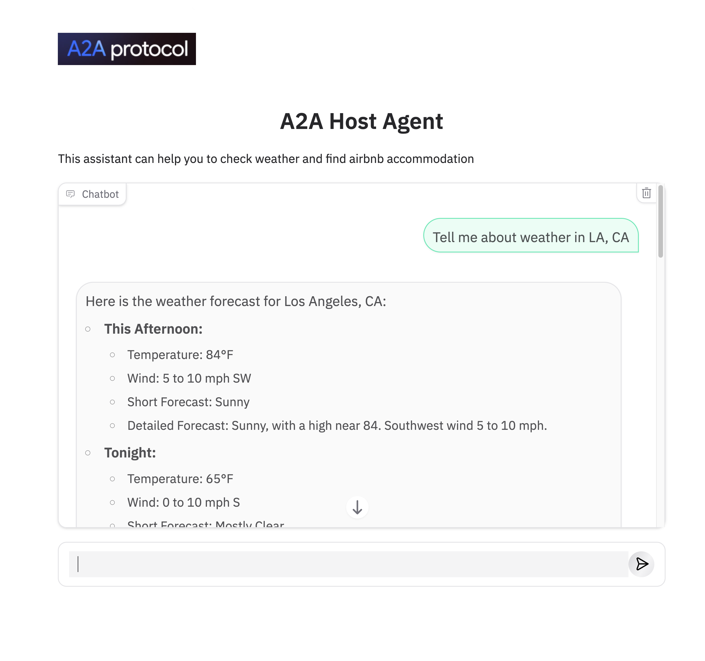

# Build Multi-Agent Systems using A2A SDK

----
> **⚠️ DISCLAIMER**: THIS DEMO IS INTENDED FOR DEMONSTRATION PURPOSES ONLY. IT IS NOT INTENDED FOR USE IN A PRODUCTION ENVIRONMENT.
>
> **⚠️ Important:** A2A is a work in progress (WIP) thus, in the near future there might be changes that are different from what demonstrated here.
----

This repository contains a fully working demonstration of the Agent2Agent (A2A) SDK.  It showcases how a Gradio-based host agent can coordinate conversations with multiple remote agents (Airbnb and Weather) that expose A2A-compatible HTTP services.

## Architecture

The demo follows a hub-and-spoke architecture. A host agent receives user messages through a Gradio interface, uses an OpenAI routing model to decide how to respond, and forwards requests to specialized remote agents (Airbnb and Weather) over the A2A protocol. The remote agents are lightweight FastAPI/Starlette services that wrap OpenAI chat models to craft domain-specific replies.


### App UI



## Setup and Deployment

### Prerequisites

Before running the application locally, ensure you have the following installed:

1. **Python 3.10+** – The services are standard Python modules packaged under `src/`.
2. **uv (recommended) or pip** – Use [uv](https://docs.astral.sh/uv/getting-started/installation/) to create a virtual environment and install the dependencies listed in `requirements.txt`.
3. **OpenAI API key** – The demo agents rely on OpenAI chat models. Set `OPENAI_API_KEY` in your environment or in a `.env` file at the repository root.

Install dependencies inside a virtual environment:

```bash
uv venv
uv pip install -r requirements.txt
# or, using pip
python -m venv .venv
source .venv/bin/activate
pip install -r requirements.txt
```

### Environment configuration

All three services load environment variables via `python-dotenv`. You can place them in a `.env` file at the repository root (or export them manually):

```bash
OPENAI_API_KEY="sk-your-api-key"
# Optional model overrides
OPENAI_MODEL="gpt-5-nano"
OPENAI_ROUTER_MODEL="gpt-5-nano"
OPENAI_AIRBNB_MODEL="gpt-5-nano"
OPENAI_WEATHER_MODEL="gpt-5-nano"

# Optional overrides for service discovery
AIR_AGENT_URL="http://localhost:10002"
WEA_AGENT_URL="http://localhost:10001"
```

Each remote agent also respects an optional `APP_URL` variable to publish an externally reachable callback URL inside its agent card.

### Running the demo locally

The services can be started with `python -m` or the provided Makefile targets. Use separate terminals for each process.

1. **Run the Weather Agent** (port `10001`):

   ```bash
   uv run python -m src.weather_agent
   # or
   make weather_agent
   ```

2. **Run the Airbnb Agent** (port `10002`):

   ```bash
   uv run python -m src.airbnb_agent
   # or
   make airbnb_agent
   ```

3. **Run the Host Agent UI** (port `11000`):

   ```bash
   uv run python -m src.host_agent
   # or
   make host_agent
   ```

The host service automatically discovers the remote agents using the `AIR_AGENT_URL` and `WEA_AGENT_URL` environment variables (defaulting to the local ports shown above).

### Interacting with the UI

Here are example questions:

- "Tell me about weather in LA, CA"

- "Please find a room in LA, CA, June 20-25, 2025, two adults"

The Gradio app runs at <http://127.0.0.1:11000/> by default.

## References

- <https://github.com/google/a2a-python>
- <https://codelabs.developers.google.com/intro-a2a-purchasing-concierge#1>
- <https://google.github.io/adk-docs/>

## Disclaimer

Important: The sample code provided is for demonstration purposes and illustrates the mechanics of the Agent-to-Agent (A2A) protocol. When building production applications, it is critical to treat any agent operating outside of your direct control as a potentially untrusted entity.

All data received from an external agent—including but not limited to its AgentCard, messages, artifacts, and task statuses—should be handled as untrusted input. For example, a malicious agent could provide an AgentCard containing crafted data in its fields (e.g., description, name, skills.description). If this data is used without sanitization to construct prompts for a Large Language Model (LLM), it could expose your application to prompt injection attacks.  Failure to properly validate and sanitize this data before use can introduce security vulnerabilities into your application.

Developers are responsible for implementing appropriate security measures, such as input validation and secure handling of credentials to protect their systems and users.
